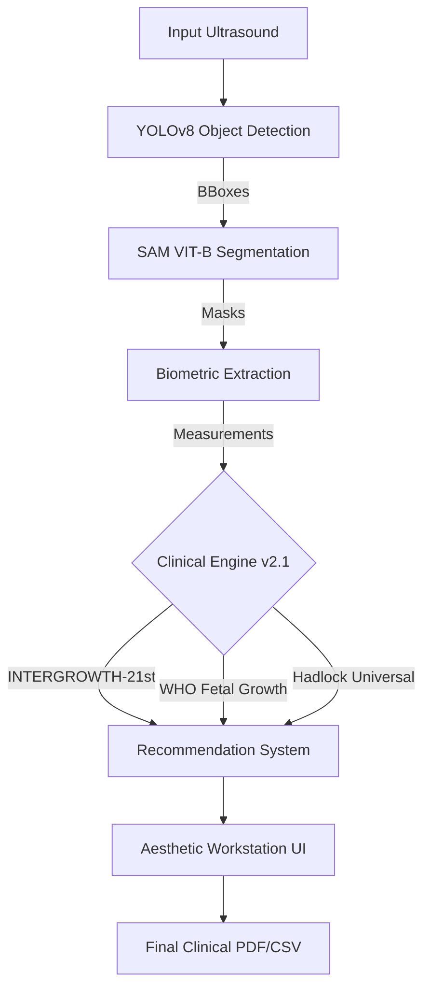

# 🏥 CradleMetrics v2.1: The Workspace Optimization Update
### Clinical Biometrics • Multi-Standard Diagnostic flexibility • Professional Workstation

CradleMetrics v2.1 transforms the fetal biometric extraction pipeline into a high-throughput clinical workstation. Building upon the AI foundation of v2.0, this version introduces real-time growth standard switching, population health metrics, and deep-level backend hardening for professional medical environments.

---

## 🛰️ System Architecture (v2.1)

CradleMetrics operates as a multi-stage pipeline, now enhanced with a real-time clinical assessment engine that supports on-the-fly standard re-evaluation.



---

## ✨ What's New in Version 2.1

### 🏥 1. Workstation Workflow Refactoring
The primary assessment interface is now optimized for high-cadence clinical use.
- **Dynamic Controls**: New **"New Analysis"** (reset) and **"Analyse Again"** (re-valuation) buttons for rapid processing.
- **Header-Centric Reporting**: Consolidated PDF actions in the results header for a distraction-free assessment.

### ⚙️ 2. Real-Time Growth Standard Switching
Introduced the "Diagnostic Toggle" for immediate comparative biometry.
- **Post-Analysis Toggling**: Switch between **INTERGROWTH-21st**, **WHO**, and **Hadlock** standards after the analysis is complete.
- **Live Percentile Updates**: Switching standards instantly re-calculates all percentiles and risk classifications without re-segmenting the image.

### 📊 3. Population Health Analytics
The Patient Directory is now a dashboard for population-level insights.
- **Live KPIs**: Real-time tracking of **Total Database Size**, **Risk Prevalence (%)**, and **Average Gestational Age**.
- **Telemetry Persistence**: Guaranteed archival of Consensus GA and Risk Status for every scan.

### 🧬 4. Advanced Clinical Biometrics
The clinical engine now provides a comprehensive obstetric profile beyond simple measurements.
- **EFW (Estimated Fetal Weight)**: Integrated **Hadlock 4-Parameter** regression for precise weight estimation (grams).
- **EDD (Estimated Date of Delivery)**: Automated calculation of the biological birth date based on composite ultrasound GA.
- **Cephalic Index (CI)**: Automated morphological assessment for dolichocephaly and brachycephaly.

### 🛡️ 5. AI Backend Hardening (Stability+)
- **Bounding Box Validation**: Strict guardrails in `SAMSegmentor` to prevent zero-sized box errors.
- **Crash Prevention**: Specifically addressed `repeat_interleave` tensor errors by filtering malformed data.
- **Boundary Guardrails**: Coordinate clipping ensures all landmarks stay within image bounds.

### 📈 6. High-Fidelity Charting & Reporting
- **Longitudinal Growth Trends**: Interactive workstation charts showing fetal growth patterns over time against global benchmarks.
- **Off-Screen Rendering**: The PDF engine now captures the full growth chart even if the examiner has not explicitly opened the charts tab.
- **Professional Labeling**: Biometric outputs are now formatted with standardized medical nomenclature.

---

## 📂 System Components

- **Detection**: Custom YOLOv8 models for anatomical plane identification.
- **Segmentation**: Segment Anything Model (SAM) for precision masking.
- **Standards**: Built-in support for INTERGROWTH-21st, WHO, and Hadlock.
- **Reporting**: Professional reportlab-based PDF generator with growth curve visualization.

---

## ⚡ Quick Start

### 1. Installation
```powershell
pip install -r requirements.txt
pip install reportlab PyYAML  # For PDF reporting
```

### 2. Launch
```powershell
python web_app/app.py
```
Navigate to `http://localhost:5000` to start analyzing scans.

---
*CradleMetrics v2.1 is designed for research and clinical assistance purposes. Always verify AI-generated measurements with manual clinical assessment.*
