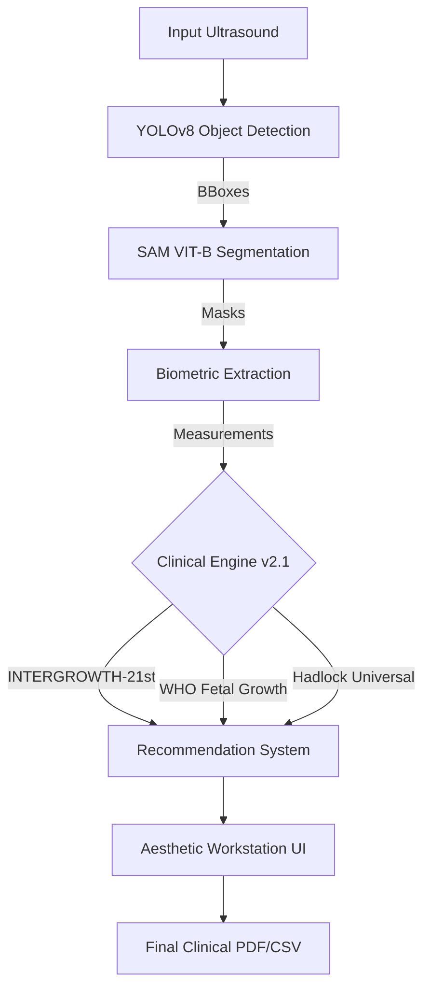

# 🏥 CradleMetrics v2.1: The Workspace Optimization Update
### Clinical Biometrics • Multi-Standard Diagnostics • Professional Workstation

CradleMetrics v2.1 is an automated fetal health analytics platform that transforms raw obstetric ultrasound images into a comprehensive clinical assessment. By leveraging state-of-the-art AI (YOLOv8 & SAM), it automates biometric extraction, clinical risk assessment, and longitudinal growth tracking to improve speed, consistency, and diagnostic accuracy in obstetrics.

---

## 🛰️ System Architecture (v2.1)

CradleMetrics operates as a high-fidelity pipeline, ensuring every pixel is analyzed with clinical context.



---

## 🩺 Clinical Methodology & Rationale

CradleMetrics automates the **Gold Standard** fetal biometry set, providing a holistic view of development:

- **HC (Head Circumference)**: Reflects brain and skull development.
- **BPD (Biparietal Diameter)**: The most reproducible measurement for gestational age.
- **AC (Abdominal Circumference)**: The most sensitive indicator of fetal nutrition and adiposity (liver size).
- **FL (Femur Length)**: Reflects skeletal maturation and longitudinal growth.

### Why Automated Biometry?
- ⏱️ **Speed**: Reduces analysis time from minutes to seconds.
- 🔁 **Consistency**: Eliminates inter-operator measurement variability.
- 🌍 **Access**: Enables specialized assessment in settings without senior sonographers.

---

## ✨ What's New in Version 2.1

### ⚙️ 1. Real-Time Growth Standard Switching
Introduced the "Diagnostic Toggle" for immediate comparative biometry.
- **Post-Analysis Toggling**: Switch between **INTERGROWTH-21st**, **WHO**, and **Hadlock** standards instantly.
- **Live Percentile Updates**: Re-calculates all risk classifications without requiring a re-upload.

### 🧬 2. Advanced Clinical Biometrics
The engine now provides a comprehensive obstetric profile:
- **EFW (Estimated Fetal Weight)**: Automatic calculation using the **Hadlock 4-Parameter** regression model.
- **EDD (Estimated Date of Delivery)**: Automated birth date calculation based on composite ultrasound GA.
- **Cephalic Index (CI)**: Automated morphological assessment (Dolichocephaly vs. Brachycephaly).
- **Clinical Ratios**: Automatic evaluation of **HC/AC** and **FL/AC** ratios for IUGR screening.

### 📊 3. Population Health Analytics
The Patient Directory serves as a dashboard for population-level insights:
- **Live KPIs**: Real-time tracking of **Total Database Size**, **Risk Prevalence (%)**, and **Average GA**.
- **Telemetry Persistence**: Guaranteed archival of Consensus GA and Risk Status for every scan.

---

## 📈 Growth Pattern Recognition

CradleMetrics automatically classifies growth into clinical categories:

| Status | Meaning | Clinical Context |
|---|---|---|
| **✅ AGA** | Appropriate for Gestational Age | Normal growth (10th–90th percentile) |
| **📉 IUGR** | Intrauterine Growth Restriction | AC < 10th percentile; monitored via HC/AC ratio |
| **📈 Macrosomia** | Large for Gestational Age | AC > 90th percentile; check for gestational diabetes |
| **🧠 Microcephaly**| Small Head Development | HC < 5th percentile; urgent review |

### 🛡️ Risk Triage System
| Level | Color | Action |
|---|---|---|
| 🟢 **Normal** | Green | Routine prenatal care |
| 🟡 **Borderline** | Amber | Close monitoring (2-4 weeks) |
| 🔴 **High Risk** | Red | Clinical review recommended (1-2 weeks) |
| ⛔ **Critical** | Dark Red | Urgent evaluation required (24-48 hours) |

---

## 📊 High-Fidelity Charting & Forecasting

- **Longitudinal Growth Trends**: Interactive workstation charts showing growth patterns against global benchmarks.
- **Predictive Forecasting**:
    - **Multi-Scan**: Uses linear regression through historical data points.
    - **Single-Scan**: Uses **Z-Score Projection** to estimate the future growth trajectory.
- **Off-Screen Rendering**: PDF engine captures the full growth chart regardless of the current UI tab.

---

## 🛠️ Technology Stack

| Component | Technology |
|---|---|
| **AI Detection** | YOLOv8 (Ultralytics) — Custom trained |
| **AI Segmentation** | Meta SAM (Segment Anything Model) ViT-B |
| **Backend** | Python 3.10 + Flask |
| **Clinical Engine** | Custom `clinical_rules.py` (Hadlock/WHO/INTERGROWTH) |
| **Visualization** | Chart.js with Interactive Workstation Overlays |
| **Reporting** | Professional PDF generation via ReportLab |

---

## ⚡ Quick Start

### 1. Installation
```powershell
pip install -r requirements.txt
pip install reportlab PyYAML  # For PDF reporting
```

### 2. Launch
```powershell
python web_app/app.py
```
Navigate to `http://localhost:5000` to start analyzing scans.

---
*CradleMetrics v2.1 is designed for research and clinical assistance purposes. Always verify AI-generated measurements with manual clinical assessment.*
